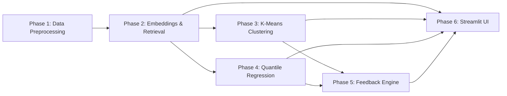

# ResuMatch — Implementation Plan

> **Course:** NYU CSCI-UA 473 · Fundamentals of Machine Learning
> **Repo:** `fml-project/` · **Dataset:** LinkedIn Job Postings 2023-2024 (Kaggle, ~124 K postings)

---

## Overview

ResuMatch is a multi-stage ML pipeline that takes a user's resume (PDF or plain text) and:

1. **Matches** it against real LinkedIn job postings via cosine-similarity retrieval.
2. **Predicts** the user's expected salary range (with confidence intervals) using quantile regression.
3. **Clusters** the job market into interpretable segments and shows where the user falls.
4. **Recommends** concrete resume improvements to move toward a target cluster or job.

All ML logic lives in `ml/`, offline pipelines live in `scripts/`, and the Streamlit frontend lives in `app/`.

---

## Phase 1 — Data Ingestion & Preprocessing

**Goal:** Transform raw Kaggle CSVs into a single, clean Parquet file ready for downstream ML.

| # | Task | File(s) | Details |
|---|------|---------|---------|
| 1.1 | Download & place raw data | `data/raw/` | Download Kaggle dataset `arshkon/linkedin-job-postings` into `data/raw/`. Expected main file is `postings.csv`; see `data/README.md` for layout. |
| 1.2 | Join CSVs | `scripts/preprocess_data.py` | Implemented. Inner-join postings ↔ companies on company ID. Left-join benefits/employee counts when present. |
| 1.3 | Normalize salary | `scripts/preprocess_data.py` | Convert all pay periods (hourly, monthly, yearly) to **annualized** salary. Drop rows without valid salary. Compute `salary_annual = median_salary` (fall back to `(min_salary + max_salary) / 2`). |
| 1.4 | Clean text fields | `scripts/preprocess_data.py` | Strip HTML from `description`. Lowercase and deduplicate `skills_desc`. Create a combined `text` column = `title + " " + description + " " + skills_desc`. |
| 1.5 | Feature engineering | `scripts/preprocess_data.py` | Map `experience_level` → ordinal int. One-hot encode `work_type` (remote/hybrid/onsite). Extract `state` from `location`. |
| 1.6 | Write processed output | `scripts/preprocess_data.py` → `data/processed/jobs.parquet` | Save as Parquet via PyArrow. Print summary stats (row count, salary distribution, null rates). |
| 1.7 | EDA notebook | `notebooks/01_data_exploration.ipynb` | Salary histograms, skill word clouds, experience-level distributions, missing-value heatmap. |

**Acceptance criteria:** `data/processed/jobs.parquet` exists, has ≥ 40 K rows with non-null salary and non-empty text.

---

## Phase 2 — Embedding & Retrieval Pipeline

**Goal:** Encode all job descriptions (and at inference time, resumes) into dense vectors; build a FAISS index for fast nearest-neighbor search.

| # | Task | File(s) | Details |
|---|------|---------|---------|
| 2.1 | Embedding module | `ml/embeddings.py` | Implemented. Wrap `sentence-transformers` (`all-MiniLM-L6-v2` by default). Expose `encode(texts: list[str]) → np.ndarray` (float32, L2-normalized). Supports injected fake model for offline unit tests. |
| 2.2 | Batch embed all jobs | `scripts/build_index.py` | Load `jobs.parquet`, embed the `text` column in batches of 256, save matrix to `models/job_embeddings.npy`. |
| 2.3 | Build FAISS index | `scripts/build_index.py` | Build `IndexFlatIP` (inner-product = cosine on normalized vectors). Save to `models/jobs.index`. |
| 2.4 | Retrieval module | `ml/retrieval.py` | `search(resume_text: str, k: int = 10) → list[dict]` — embed the resume, query FAISS, return top-k results with job metadata and similarity scores. |
| 2.5 | Embedding experiments notebook | `notebooks/02_embedding_experiments.ipynb` | Compare models (MiniLM vs mpnet). Visualize embeddings with t-SNE / UMAP. Sanity-check retrieval with hand-crafted queries. |

**Acceptance criteria:** Given a software-engineering resume, the top-5 results are plausible SWE job postings, and search completes in < 200 ms.

---

## Phase 3 — K-Means Clustering

**Goal:** Discover interpretable job-market segments from embeddings.

> ⚠️ **Grading constraint:** Implement K-Means from scratch in NumPy/PyTorch — **not** sklearn.

| # | Task | File(s) | Details |
|---|------|---------|---------|
| 3.1 | K-Means implementation | `ml/clustering.py` | Implemented as a NumPy `KMeans` class with `fit`, `predict`, `inertia`, `save`, and `load`. Current implementation uses Euclidean distance; real embedding experiments should confirm whether to switch to cosine distance. |
| 3.2 | Choose K | `ml/clustering.py` or notebook | Elbow method (inertia vs k) and silhouette score. Target k ≈ 5–10. |
| 3.3 | Label clusters | `scripts/build_index.py` | After clustering, extract top-10 TF-IDF terms per cluster to auto-generate labels (e.g., "Data Science / Analytics", "Frontend Engineering"). Save `models/cluster_centroids.npy` and `models/cluster_labels.json`. |
| 3.4 | Assign cluster to user | `ml/clustering.py` | `assign(embedding) → (cluster_id, distances_to_all_centroids)` — used in the app to show the user's market position. |

**Acceptance criteria:** Clusters are semantically coherent (manual inspection). Silhouette score ≥ 0.15 (embedding space).

---

## Phase 4 — Quantile Regression (Salary Prediction)

**Goal:** Predict salary **distributions** (10th, 25th, 50th, 75th, 90th percentiles) to give ranges with uncertainty.

> ⚠️ **Grading constraint:** Must be implemented in **raw PyTorch** (custom `nn.Module`, manual training loop) — **not** sklearn.

| # | Task | File(s) | Details |
|---|------|---------|---------|
| 4.1 | Model architecture | `ml/salary_model.py` | `SalaryQuantileNet(nn.Module)`: input = embedding dim (384 or 768) + engineered features, hidden layers (256 → 128 → 64), output = 5 quantile heads. Pinball (quantile) loss function. |
| 4.2 | Dataset & DataLoader | `ml/salary_model.py` | `SalaryDataset(Dataset)`: loads embeddings + salary targets. Train/val/test split (80/10/10, stratified by experience level). |
| 4.3 | Training loop | `scripts/train_salary_model.py` | Adam optimizer, LR scheduler (ReduceLROnPlateau), early stopping on val loss. Log metrics with print or TensorBoard. Save best checkpoint to `models/salary_model.pt`. |
| 4.4 | Inference API | `ml/salary_model.py` | `predict_salary(resume_embedding: np.ndarray) → dict` returning `{q10, q25, q50, q75, q90}` in USD. |
| 4.5 | Evaluation notebook | `notebooks/03_salary_regression.ipynb` | Calibration plots (actual fraction below predicted quantile vs nominal quantile). MAE of median prediction. Residual analysis. |

**Acceptance criteria:** Quantile calibration within ±5 pp (e.g., 50th percentile captures ~45–55 % of actuals). Median MAE < $15 K on test set.

---

## Phase 5 — Resume Feedback Engine

**Goal:** Generate actionable, interpretable suggestions for improving a user's resume toward a target job or cluster.

| # | Task | File(s) | Details |
|---|------|---------|---------|
| 5.1 | Gap analysis | `ml/retrieval.py` (or new `ml/feedback.py`) | Compare the user's resume embedding vs. the centroid of a target cluster (or top-matching job embedding). Identify the **direction vector** (target − resume). |
| 5.2 | Keyword extraction | `ml/feedback.py` | Project the direction vector back into token space (using the embedding model's vocabulary or TF-IDF terms from the target cluster). Return top-N missing skills / keywords. |
| 5.3 | Phrase-level highlighting | `ml/feedback.py` | Given the resume text and matched job descriptions, use set-difference on extracted skill n-grams to find **present strengths** and **missing keywords**. |
| 5.4 | Cluster migration advice | `ml/feedback.py` | If the user selects a desired cluster different from their current one, show the skill/experience gap between the two cluster centroids. |

**Acceptance criteria:** For a data-science resume matched against an SWE cluster, suggestions include plausible items (e.g., "Add: REST APIs, CI/CD, system design").

---

## Phase 6 — Streamlit UI & Integration

**Goal:** Build a polished, multi-page Streamlit app that ties all ML modules together.

| # | Task | File(s) | Details |
|---|------|---------|---------|
| 6.1 | App shell & navigation | `app/app.py` | Multi-page setup via `st.navigation` or sidebar pages. Global state for uploaded resume. |
| 6.2 | Resume upload page | `app/pages/01_upload.py` | PDF upload (extract text via `pdfplumber` or `PyPDF2`) **and** paste-text input. Store parsed text in `st.session_state`. |
| 6.3 | Job matching page | `app/pages/02_matches.py` | Show top-10 matching jobs in an expandable card layout. Display similarity score, title, company, salary, skills. Filters for experience level and location. |
| 6.4 | Salary prediction page | `app/pages/03_salary.py` | Fan chart (Plotly) showing predicted salary quantiles. Compare against actual distribution for the user's cluster. |
| 6.5 | Market position page | `app/pages/04_market.py` | 2D t-SNE/UMAP scatter (Plotly) of job clusters with the user's resume plotted as a highlighted point. Cluster labels as hover text. |
| 6.6 | Resume feedback page | `app/pages/05_feedback.py` | Display missing keywords, highlighted resume text (green = strength, red = gap), and cluster-migration advice. |
| 6.7 | Reusable components | `app/components/` | Shared widgets: resume text preview, job card, salary chart, cluster legend. |

**Acceptance criteria:** Full end-to-end flow works: upload resume → view matches → see salary → see market position → get feedback. No crashes on edge cases (empty resume, missing data).

---

## Task Dependency Graph



Phases 3 and 4 can be worked on **in parallel** once Phase 2 is done. Phase 5 depends on both 3 and 4. Phase 6 can start its shell (6.1, 6.2) early, but full integration requires all prior phases.

---

## Grading-Critical Constraints

| Requirement | Rule |
|---|---|
| Quantile regression | **Raw PyTorch** `nn.Module` + manual training loop. No sklearn regressors. |
| K-Means clustering | **NumPy or PyTorch** implementation. No `sklearn.cluster.KMeans`. |
| ML logic separation | All ML code in `ml/`. No Streamlit imports inside `ml/`. |
| Reproducibility | Set `torch.manual_seed()` and `np.random.seed()` in all scripts. |
| Tests | `tests/` must have pytest coverage for core `ml/` functions. |

---

## Current Setup Commands

```bash
uv sync
uv run pytest
uv run python scripts/preprocess_data.py
uv run python scripts/build_index.py
uv run streamlit run app/app.py
```

Raw Kaggle data is required before `preprocess_data.py` and the real
`build_index.py` path can run end-to-end. Without raw data, use:

```bash
uv run python scripts/build_index.py --smoke
```

## Suggested Team Assignment (5 members)

| Member | Primary Ownership | Phases |
|---|---|---|
| Member A | Data preprocessing + EDA | 1 |
| Member B | Embeddings + FAISS retrieval | 2 |
| Member C | K-Means clustering (from scratch) | 3 |
| Member D | Quantile regression model (PyTorch) | 4 |
| Member E | Streamlit UI + Feedback engine | 5, 6 |

All members contribute to integration testing and the final report.
